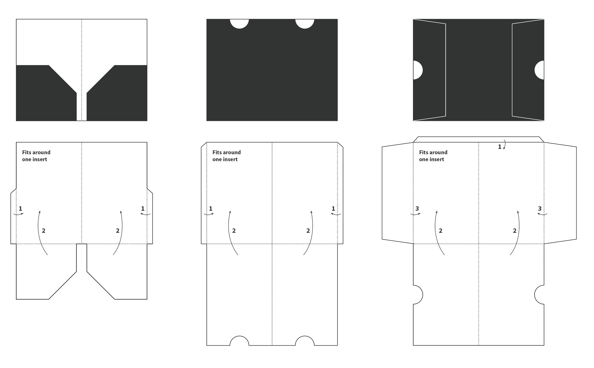
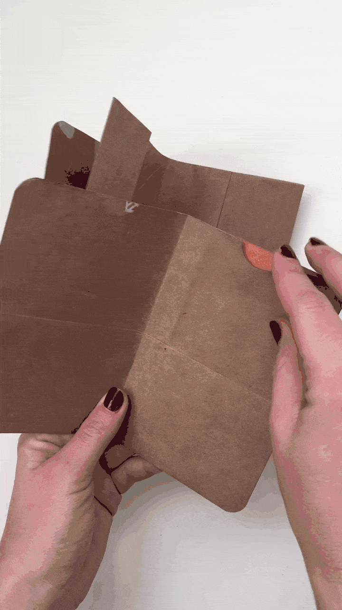

# Traveler's Notebook (Field Notes size) Pocket and Folder Inserts

These are templates for creating pockets and folders that fit with a Traveler's Notebook made to fit Field Notes notebooks 📔 🖋

Only the `folder.png` fits on a standard Letter paper. The others you'll need to print on larger paper or on multiple sheets.

Once they're printed, I trace that onto heavier cardstock and use that as my final template.

### TN Passport Size

Some people put Field Notes notebooks inside of the official TN passport size so you could try these with that set up, too. The passport size is just a bit shorter (in height) than the Field Notes notebooks so you could take these templates and adjust.

### Notes

Dotted lines are folding lines, solid lines are cut lines.

### Result!

